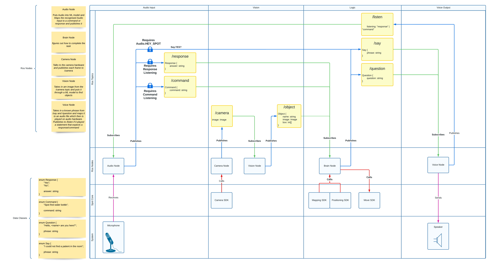

# SPOT
This project is to be an example of how SPOT can be used with 
ROS Noetic to produce a system that can listen and receive an audible command 
like "find Lucy Wang in room 5", and for SPOT to navigate to room 5, and search for 
Lucy Wang's matching face, then report back to the doctor.

##Architecture
